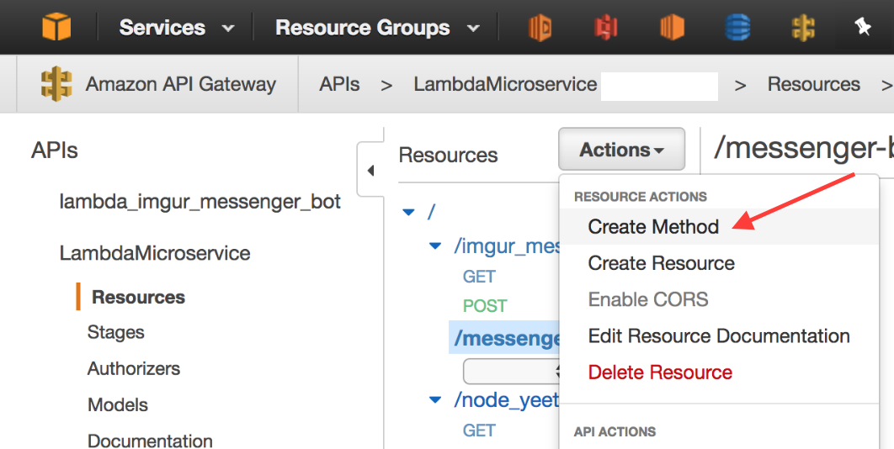
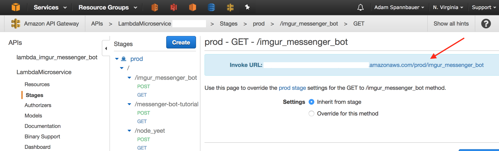

# WIP
# Facebook Messenger Chat Bot with AWS Lambda, AWS API Gateway, & Python
### (written by an R programmer)

****************

## How to:

### I. Facebook Stuff
* Login/create account at [developers.facebook.com](https://developers.facebook.com)
* Go to your [app page](https://developers.facebook.com/apps) & create a new app

### II. AWS Stuff
#### Lambda Stuff
* Login/create an AWS account at [aws.amazon.com](https://aws.amazon.com/)
* Create a blank lambda function (no need to set a trigger at this point)
   * If you've never created a lambda function before follow [this guide](http://docs.aws.amazon.com/lambda/latest/dg/get-started-create-function.html) to create a Hello World python function.  We'll use the same setup in this example.
* On your new function's page on the Code tab, select upload a .ZIP file, upload the file parrot\_lambda\_env.zip from [my github](https://github.com/AdamSpannbauer/aws_python_messenger)
</img>
  * The contents of the zip file are the contents of the parrot\_lambda\_env directory in the same repo.  The directory contains the python module [requests]() and a [python script](https://github.com/AdamSpannbauer/aws_python_messenger/blob/master/parrot_lambda_env/lambda_function.py) with definitions for functions to handle messenger events

#### API Gateway Stuff
* Go to [API Gateway](https://console.aws.amazon.com/apigateway) 
* Create new api
</img>
   * After clicking Create New API, select New API, and give your API a name & description
* Create a new resource
</img>
   * Click Actions, select Create Resource from the dropdown menu, and give your resource a name & description
* Create GET and POST methods
</img>
	* Click Actions & select create method
	* Select GET from the select menu that appears below your resource name
	* Select Lambda Function for the integration type, select a region near you, and fill in the name of your Lambda Function in the text input that appears after selecting a region.  Save all of your these settings to continue.
	* Select Integration Request and expand the section for Body Mapping Templates
</img>
	* Type 'application/json' in the text input and click the checkmark
	* Select Method Request passthrough from the Generate Template dropdown and click save
</img>
	* Repeat the same process to create a POST method
* Deploy your API
	* Click on your Resource in the list of Resources, click Actions, and select Deploy API
	* Select the deployment stage and a description then click Deploy
* Copy the invoke URL for your API resource
</img>
	* From the Stages page of your API click on your new resource you just created
	* Copy the Invoke URL that appears

### III. More Facebook Stuff
* Set up webhook
* Set up other stuff
* test
* submit for approval
* go live