# Facebook Messenger Chat Bot with AWS Lambda, AWS API Gateway, & Python
### (written by an R programmer)

****************

_Note: Please let me know if you follow the tutorial and are unable to setup a messenger bot successfully; I'd be happy to update the steps to make the tutorial more useful. Please [submit an issue](https://github.com/AdamSpannbauer/aws_python_messenger/issues) describing the problem or if you know the fix please feel free to submit a pull request to [the repo](https://github.com/AdamSpannbauer/aws_python_messenger#fork-destination-box) with a modified README._

### Steps:

  * [AWS Setup](#i-aws-stuff)
  	* [Lambda](#lambda-stuff)
  	* [API Gateway](#api-gateway-stuff)
  * [Facebook Setup](#ii-facebook-stuff)
  * [Deployment](#iii-deployment)
  * [Customizing Functionality](#iv-customizing-functionality)

### I. AWS Stuff
#### Lambda Stuff
* Login/create an AWS account at [aws.amazon.com](https://aws.amazon.com/)
* Create a blank lambda function (no need to set a trigger at this point)
   * If you've never created a lambda function before follow [this guide](http://docs.aws.amazon.com/lambda/latest/dg/get-started-create-function.html) to create a Hello World python function.  We'll use the same setup in this example.
* On your new function's page on the Code tab, select upload a .ZIP file, upload the file parrot\_lambda\_env.zip from [my github](https://github.com/AdamSpannbauer/aws_python_messenger)
</img>
  * The contents of the zip file are the contents of the parrot\_lambda\_env directory in the same repo.  The directory contains the python module [requests]() and a [python script](https://github.com/AdamSpannbauer/aws_python_messenger/blob/master/parrot_lambda_env/lambda_function.py) with definitions for functions to handle messenger events

#### API Gateway Stuff
* Go to [API Gateway](https://console.aws.amazon.com/apigateway) 
* Create new api
</img>
   * After clicking Create New API, select New API, and give your API a name & description
* Create a new resource
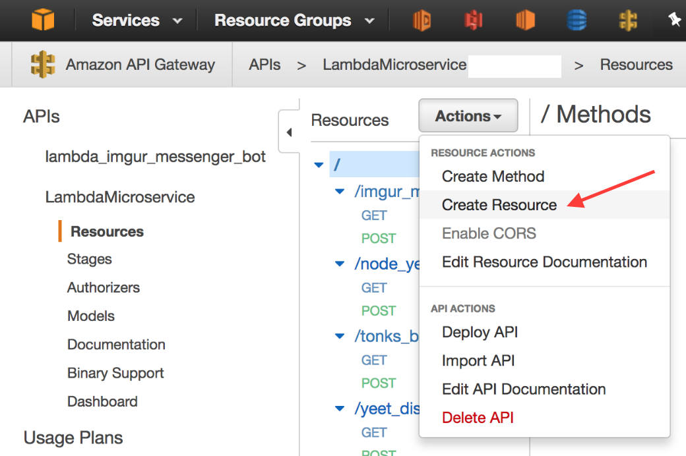</img>
   * Click Actions, select Create Resource from the dropdown menu, and give your resource a name & description
* Create GET and POST methods
</img>
	* Click Actions & select create method
	* Select GET from the select menu that appears below your resource name
	* Select Lambda Function for the integration type, select a region near you, and fill in the name of your Lambda Function in the text input that appears after selecting a region.  Save all of your these settings to continue.
	* Select Integration Request and expand the section for Body Mapping Templates
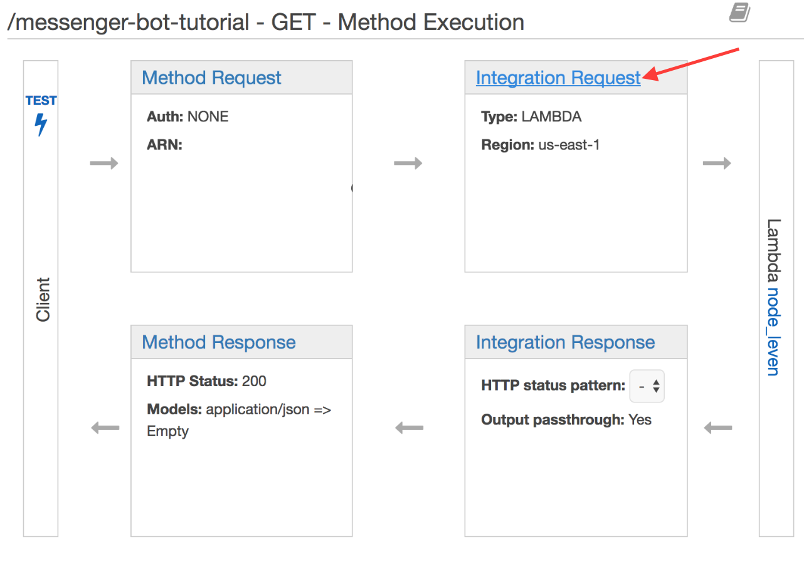</img>
	* Type 'application/json' in the text input and click the checkmark
	* Select Method Request passthrough from the Generate Template dropdown and click save
</img>
	* Repeat the same process to create a POST method
* Deploy your API
	* Click on your Resource in the list of Resources, click Actions, and select Deploy API
	* Select the deployment stage and a description then click Deploy
* Copy the invoke URL for your API resource
</img>
	* From the Stages page of your API click on your new resource you just created
	* Save the Invoke URL that appears for use later

### II. Facebook Stuff
* Login/create account at [developers.facebook.com](https://developers.facebook.com)
* Go to your [app page](https://developers.facebook.com/apps) & create a new app from the sidebar; fill in a display name and contact email & click creat app id
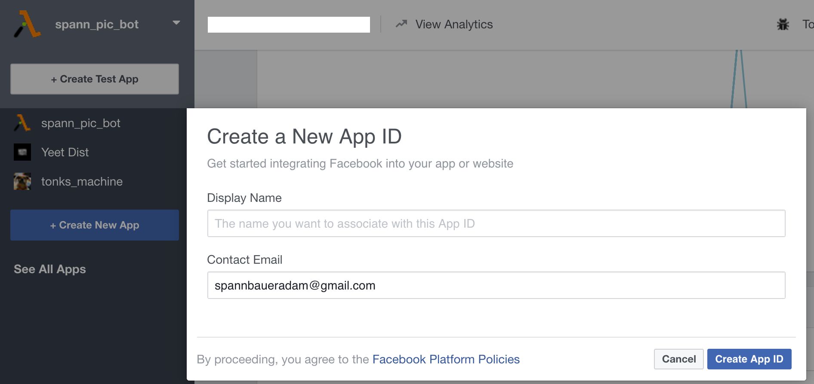</img>
* Generate Access Token
	* Click Add Product in the sidebar of your new app's dashboard and click Get Started in the messenger section
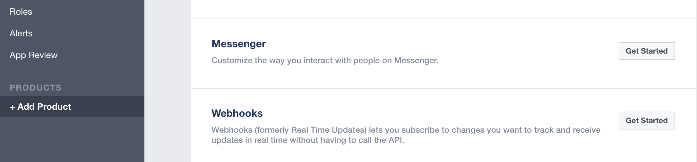</img>
	* Scroll down to the Token Generation section and select/create a page for your bot to send messages from
	* Save the access token that is generated for later
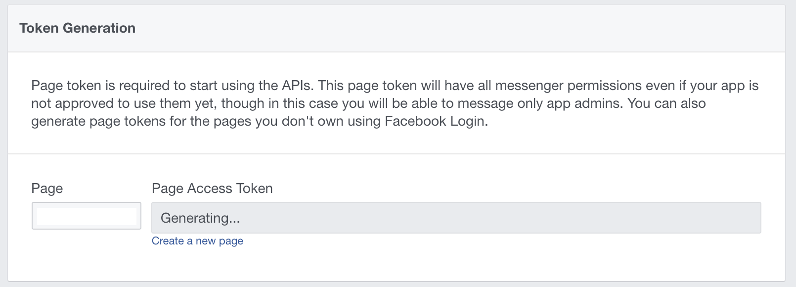</img>
* Set up webhook
	* Scroll down to the webhooks section of the messenger product settings and click setup webhooks
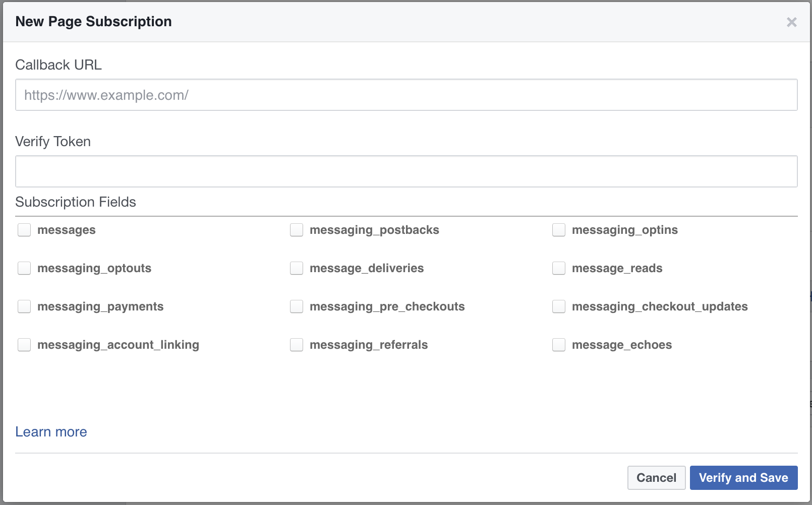
	* Paste you Invoke URL from the API Gateway setup into the Callback URL field
	* Make up a verification token and fill out the Verify Token field; save the token with the access token for use later
	* Check all of the subscription fields for now
	* Leave the window open, after some setup on the Lambda function we will be able to verify the webhook

### III. Deployment
* Define Environment Variables for your acces and verification tokens
	* Navigate back to your Lambda function's code tab and scroll to the bottom to the Environment Variables section
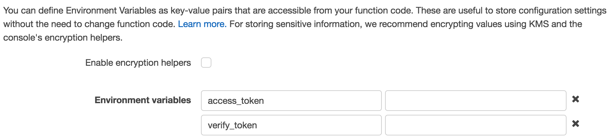</img>
	* Define 2 environment variables named `access_token` and `verify_token`; paste in the values of your tokens saved during facebook setup
* Verify webhook
	* Click Verify and Save on the New Page Subscription window
	* The setup we've done with API Gateway & Lambda should lead to a successful verification
* Subscibe a page to your webhook 
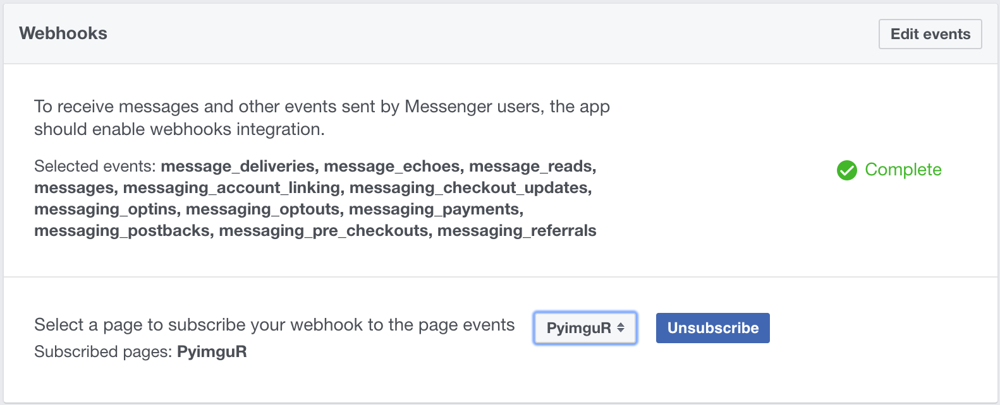</img>
	* Select the page who's access token you set as the environment variable from the dropdown in the webhooks section and click subscribe
* Test the bot
	* Message the subscribed page through your facebook account
	* If everything is set up correctly the bot should echo your message text back
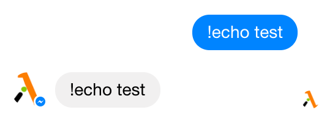</img>
* To make your bot available to other users you will have to submit it for approval
	* Click add to submission in the App Review for Messenger section of your app's messenger product settings 
	* A current submission section will appear and tell you what items you must take care of before submitting (I used [privacypolicies.com](http://privacypolicies.com) for the privacy policy needed for approval)
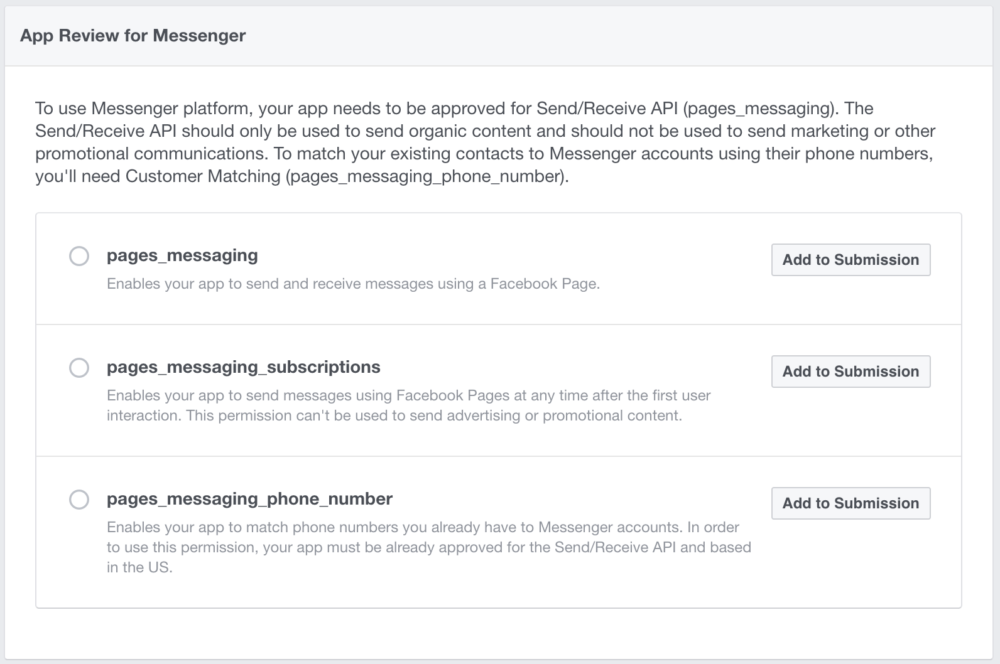</img>

### IV. Customizing Functionality
* To add more interesting functionality you can edit the lambda\_handler function definition in [lambda\_function.py](https://github.com/AdamSpannbauer/aws_python_messenger/blob/master/parrot_lambda_env/lambda_function.py)
	* You can add whatever logic you want to produce a customized response 
	* Once you add the additional logic you can replace msg\_txt in the send\_message function call
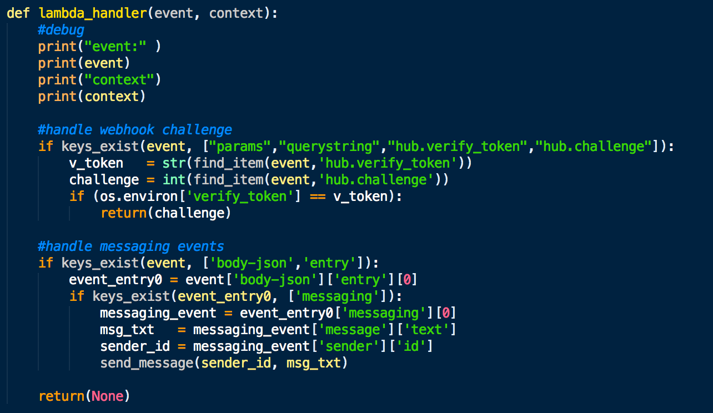</img>
* Sending Attachments
	* An example of how to send attachments can be seen in [here](https://github.com/AdamSpannbauer/aws_python_messenger/tree/master/imgur_lambda_env/lambda_function.py) in a bot written to send a picture response from imgur
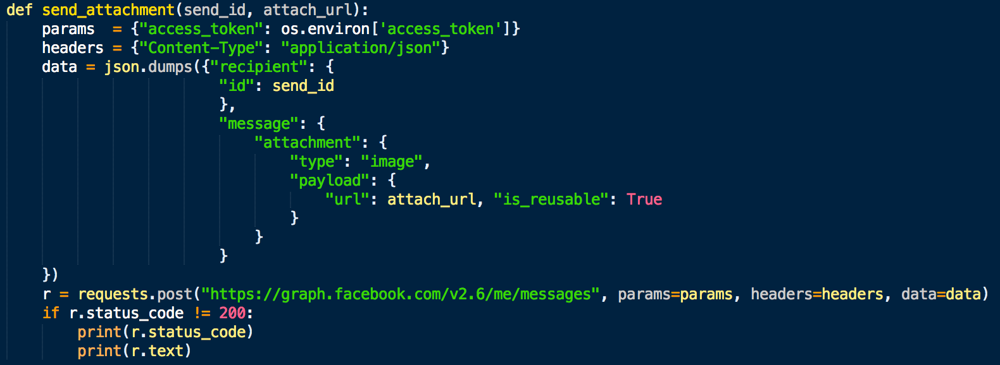</img>
		* You can try out using this bot yourself by uploading the [imgur\_lambda\_env.zip](https://github.com/AdamSpannbauer/aws_python_messenger/blob/master/imgur_lambda_env.zip) as the lambda function to be set up just by using steps I-III of the tutorial (you'll just need to add an imgur client id as the environment variable `imgur_client_id `)
		* The imgur bot searches messages received on imgur and responds with a randomly selected picture from the search results
* Adding additional modules
	* If you need add additional python modules to acheive your desired functionality you can follow this [AWS Lambda tutorial](http://docs.aws.amazon.com/lambda/latest/dg/lambda-python-how-to-create-deployment-package.html) for creating a python deployment package
